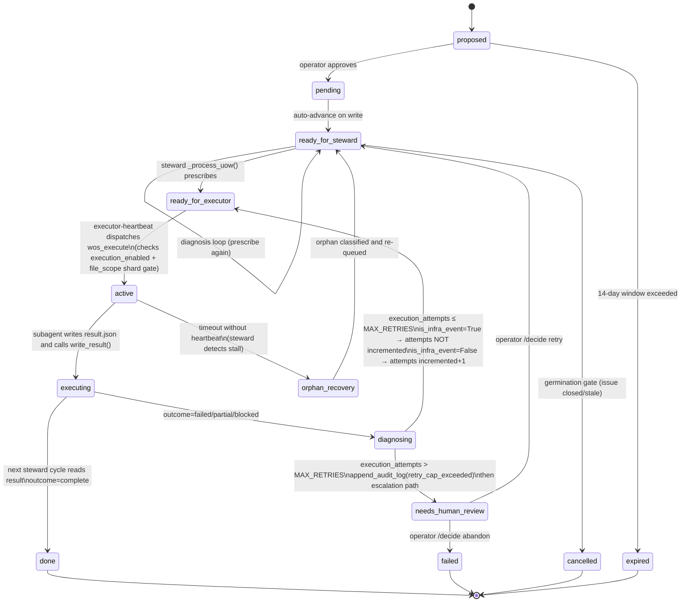
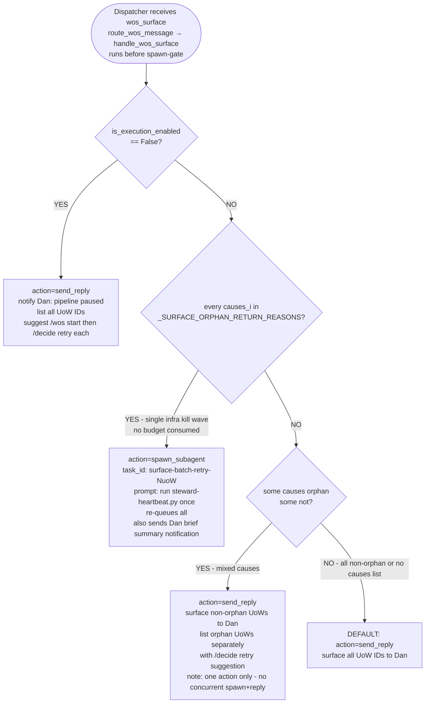
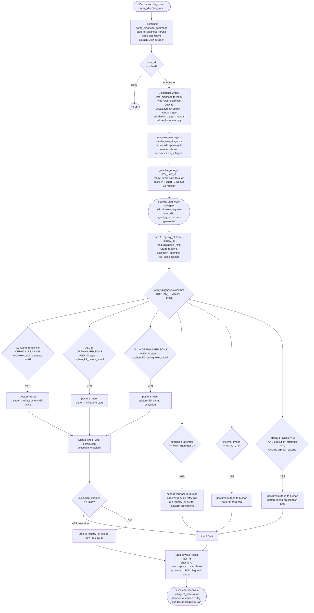
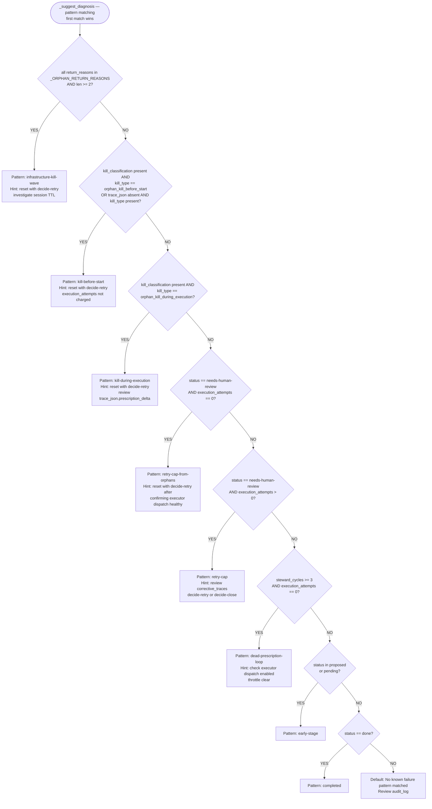

# WOS Architecture — Canonical Reference
*Produced: 2026-04-26*
*Covers PRs #965–#981*

## Related Documents

**Supersedes:** [escalation-architecture-20260426.md](../workstreams/wos/reports/escalation-architecture-20260426.md) *(ASCII diagrams, pre-PRs #980–#981)*

**Referenced by:**
- [WOS Failure Runbook](../workstreams/wos/runbooks/failure-diagnosis.md) — failure signatures and triage procedure
- [Self-Diagnosing Subagent Design](../workstreams/wos/design/self-diagnosing-subagent-design.md) — T1-B implementation context
- [Vision Inlet Design](../workstreams/wos/design/vision-inlet-design.md) — T2-C observation loop

**Key PRs:** #965 (execution_attempts), #966 (escalation consolidation), #967 (trace.json orphan diagnosis), #968 (heartbeat kill classification), #970 (wos_escalate handler), #973 (exhaustiveness test), #974 (steward write path), #976 (registry_cli trace), #980 (wos_diagnose handler), #981 (wos_surface handler)

Source files read:
- `~/lobster/src/orchestration/steward.py` — lifecycle, execution_attempts, orphan classification, escalation write paths
- `~/lobster/src/orchestration/dispatcher_handlers.py` — handle_wos_escalate, handle_wos_surface, handle_wos_diagnose, route_wos_message
- `~/lobster/src/orchestration/registry_cli.py` — cmd_trace, _suggest_diagnosis, _ORPHAN_RETURN_REASONS

---

## Section 1: UoW Lifecycle State Machine

> See also: [WOS Failure Runbook](../workstreams/wos/runbooks/failure-diagnosis.md) — for failure signatures (kill-before-start, kill-during-execution, dead-prescription-loop) that correspond to the transitions shown here.



**Terminal states:**
- `done` — all prescribed steps confirmed complete
- `failed` — user_closed (decide-close) OR hard_cap_cleanup
- `cancelled` — germination gate: issue closed
- `needs-human-review` — retry cap exceeded; awaiting human decision
- `expired` — proposal exceeded 14-day window without approval

---

## Section 2: Steward Cycle Flow

> See also: [Self-Diagnosing Subagent Design](../workstreams/wos/design/self-diagnosing-subagent-design.md) — T1-B covers the planned replacement of inline triage with a tool-backed diagnosis subagent spawned from this cycle.

```mermaid
flowchart TD
    A([steward cycle begins\n_pending_escalations = []]) --> B

    B[for each UoW in ready-for-steward\nBOOTUP_CANDIDATE_GATE: skip if label set] --> C

    C{Is UoW reentry posture\nin _ORPHAN_POSTURES?\nexecutor_orphan / executing_orphan\n/ diagnosing_orphan} -->|YES| D
    C -->|NO| I

    D[_classify_orphan_from_trace\ntrace_data + output_ref] --> E

    E{result.json present\nalongside output_ref?} -->|YES → completed_without_output| F
    E -->|NO| E2

    E2{trace.json absent?} -->|YES → kill_before_start default| F
    E2 -->|NO| E3

    E3{trace.json has surprises\nor prescription_delta?} -->|YES → kill_during_execution| F
    E3 -->|DEFAULT → kill_before_start| F

    F[Write orphan_kill_classified audit entry\nkill_type + heartbeats_before_kill + ts] --> G

    G{return_reason in\nORPHAN_REASONS?} -->|YES → is_infra_event=True\nexecution_attempts NOT incremented| H
    G -->|NO → is_infra_event=False\nexecution_attempts incremented +1| H

    I[Normal processing path] --> H

    H{execution_attempts\n> MAX_RETRIES?} -->|YES| J
    H -->|NO| K

    J[RETRY CAP EXCEEDED\ntransition: diagnosing → needs-human-review\nappend_audit_log retry_cap_exceeded] --> L

    K[prescribe again\nready-for-executor] --> N

    L{escalation_notifier\ninjected?\nnot dry_run} -->|YES - collector path| M
    L -->|NO - direct path| M2

    M[_collect_escalation:\nread audit_log\nextract execution_attempts\ndetermine reentry_posture\nappend EscalationRecord to _pending_escalations] --> N

    M2[_write_wos_escalate_message\ntype=wos_escalate] --> N

    N([end of UoW loop]) --> O

    O{lifetime_cycles + steward_cycles\n>= _EARLY_WARNING_CYCLES 4?} -->|YES| P
    O -->|NO| Q

    P[write wos_early_warning\nto inbox - informational] --> Q

    Q{len _pending_escalations\n>= THRESHOLD 3?} -->|YES| R
    Q -->|NO| S

    R[_send_consolidated_escalation_notification\nONE message:\ntype=wos_surface\ncondition=retry_cap_consolidated\nescalation_count=N\ncauses + uow_ids] --> T([cycle complete])

    S[for each EscalationRecord:\n_write_wos_escalate_message\nindividual wos_escalate per UoW] --> T
```

---

## Section 3: Escalation Paths (Two Tracks)

### Track A — wos_escalate (per-UoW)

> See also: [Self-Diagnosing Subagent Design](../workstreams/wos/design/self-diagnosing-subagent-design.md) — the 4-branch dispatcher tree below is the T1-B inline triage that the self-diagnosing subagent is designed to replace.

**Message fields written by `_write_wos_escalate_message()`:**

```
type: "wos_escalate"
uow_id: <str>
uow_title: <str>
register: <operational|human-judgment|philosophical|iterative-convergent>
failure_history:
  execution_attempts: <int>          (confirmed dispatches, not total retries)
  return_reason_classification: <str> (orphan|error|abnormal)
  kill_type: <str>                   (orphan_kill_before_start|orphan_kill_during_execution)
  heartbeats_before_kill: <int>      (0 = killed before execution)
posture: <str>                       (trace-diagnosed reentry posture)
suggested_action: <str>             (mirrors 4-branch tree; informational)
```

```mermaid
flowchart TD
    A([Dispatcher receives wos_escalate\nroute_wos_message → handle_wos_escalate\nruns before spawn-gate]) --> B4

    B4{register in\nhuman-judgment\nor philosophical?} -->|YES| C4[action=send_reply\nsurface to Dan\n/decide proceed or abandon]
    B4 -->|NO| B3

    B3{execution_attempts\n>= 3?} -->|YES| C3[action=send_reply\nsurface to Dan\n/decide retry or abandon]
    B3 -->|NO| B1

    B1{execution_attempts == 0\nAND classification == orphan?} -->|YES| C1[action=spawn_subagent\ntask_id: escalate-retry-<uow_id12>\nprompt: run steward-heartbeat.py\nauto-retry: no budget consumed]
    B1 -->|NO| B2

    B2{execution_attempts > 0\nAND classification == orphan?} -->|YES| C2[action=spawn_subagent\ntask_id: escalate-midexec-<uow_id12>\nprompt: run steward-heartbeat.py\nretry with resume context]
    B2 -->|NO| CD[DEFAULT: action=send_reply\nsurface to Dan for review\nunclassified failure]

    C1 --> ACT_SPAWN
    C2 --> ACT_SPAWN
    C3 --> ACT_REPLY
    C4 --> ACT_REPLY
    CD --> ACT_REPLY

    ACT_SPAWN([spawn background subagent\nruns steward-heartbeat.py\nsteward re-queues UoW → ready-for-executor\nexecutor dispatches again])
    ACT_REPLY([send_reply to ADMIN_CHAT_ID\nDan sees Telegram notification\n/decide retry|abandon|defer])
```

### Track B — wos_surface (batch kill-wave)

**Condition A (PR #966):** >= 3 UoWs escalate in one steward cycle — replaces N individual `wos_escalate` messages.

**Condition B (fallback):** `_write_wos_escalate_message()` raises OSError — falls through to surface-all-to-Dan branch.



**`_SURFACE_ORPHAN_RETURN_REASONS` (raw return_reason strings):**
- `executor_orphan`
- `executing_orphan`
- `diagnosing_orphan`
- `orphan_kill_before_start`
- `orphan_kill_during_execution`

---

## Section 4: Diagnosis Path

> See also: [Self-Diagnosing Subagent Design](../workstreams/wos/design/self-diagnosing-subagent-design.md) — full implementation spec for the subagent spawned by this path, including the diagnosis algorithm, safety constraints, and PR sequence.



**Diagnosis output JSON fields:**
```
event, uow_id, escalation_id, escalation_trigger,
pattern_matched, confidence, posture,
action_taken, rationale,
execution_attempts_at_diagnosis, lifetime_cycles_at_diagnosis,
surface_message (if posture=surface-to-human),
timestamp
```

**Constraints:**
- Max 3 shell commands total: trace + optionally get + optionally decide-retry
- Never call decide-close (requires human confirmation)
- Never send Telegram messages directly (write_result only)
- One UoW per invocation — no batch loops

---

## Section 5: Forensics — registry_cli trace

> See also: [WOS Failure Runbook](../workstreams/wos/runbooks/failure-diagnosis.md) — operational procedures for reading trace output and triaging each failure signature.

**Invocation:** `uv run registry_cli.py trace --id <uow_id>`

`cmd_trace()` joins five data sources:

1. `registry.get(uow_id)` → `current_state`: {status, execution_attempts, lifetime_cycles, steward_cycles, retry_count, heartbeat_at, output_ref, close_reason, started_at}
2. `registry.fetch_audit_entries(uow_id)` → `audit_log`: chronological list of all status transitions, retry_cap events, orphan_kill_classified entries
3. `registry.fetch_corrective_traces(uow_id)` → `corrective_traces`: executor observations per attempt (partial work, context from prior runs)
4. `_extract_return_reasons(audit_entries)` → `return_reasons`: [{ts, event, return_reason}] from audit note JSON
5. `_extract_kill_classification(audit_entries)` → `kill_classification`: most recent orphan_kill_classified entry {kill_type, heartbeats_before_kill, ts} or null
6. `_read_trace_json(output_ref)` → `trace_json`: parsed trace.json from output_ref path, or null
   - Primary: `Path(output_ref).with_suffix(".trace.json")`
   - Fallback: `Path(str(output_ref) + ".trace.json")`
7. `_suggest_diagnosis(uow, return_reasons, kill_classification, trace_json)` → `diagnosis_hint`: one-paragraph actionable summary



**`_ORPHAN_RETURN_REASONS` (module-level, importable by tests):**
- `executor_orphan`
- `executing_orphan`
- `diagnosing_orphan`
- `orphan_kill_before_start` (PR #968 — heartbeat-classified)
- `orphan_kill_during_execution` (PR #968 — heartbeat-classified)

**Registry CLI command reference:**
```
trace --id <uow_id>                full forensics view (start here)
get --id <uow_id>                  raw UoW row with all fields
list [--status <status>]           list UoWs, optional status filter
approve --id <uow_id>              proposed → pending
decide-retry --id <uow_id>         blocked/ready-for-steward → ready-for-steward
                                   (steward_cycles reset to 0)
decide-close --id <uow_id>         blocked → failed (user_closed)
status-breakdown                   count UoWs by status (JSON object)
escalation-candidates              list needs-human-review UoWs
stale [--buffer-seconds N]         list in-flight UoWs with silent heartbeats
check-stale                        active UoWs whose source issue is closed
expire-proposals                   expire proposed records older than 14 days
gate-readiness                     WOS autonomy gate metric
upsert --issue N --title T         propose a UoW for a GitHub issue
```

---

## Section 6: Gap Analysis

### WOS_MESSAGE_TYPE_DISPATCH (current state)

```python
WOS_MESSAGE_TYPE_DISPATCH = {
    "wos_execute":      "handle_wos_execute",      # IMPLEMENTED
    "steward_trigger":  "handle_steward_trigger",   # IMPLEMENTED
    "wos_escalate":     "handle_wos_escalate",      # IMPLEMENTED (PR #970)
    "wos_surface":      "handle_wos_surface",       # IMPLEMENTED (PR #981)
    "wos_diagnose":     "handle_wos_diagnose",      # IMPLEMENTED (PR #980)
}
```

### Gap 1: wos_surface mixed-branch cannot spawn + reply simultaneously

**Code location:** `handle_wos_surface()`, lines ~1038–1068 in dispatcher_handlers.py

In the mixed-causes branch (some orphans, some non-orphans), the handler returns
`action="send_reply"` and lists both categories for Dan. It cannot simultaneously
spawn a steward heartbeat for the orphan UoWs AND send Dan a reply about the
non-orphan UoWs — the architecture returns one action per message.

**Consequence:** Dan sees a list of both orphan and non-orphan UoWs and must issue
`/decide retry` for each orphan manually, even though they could be auto-retried.
This is documented in the handler comment: no workaround is currently wired.

**When it fires:** Only in the mixed-causes case. The all-orphan branch auto-retries
correctly. The no-causes / non-orphan branch surface-to-Dan correctly.

---

### Gap 2: wos_early_warning has no dispatcher handler

**Code location:** `_default_notify_dan_early_warning()` in steward.py (around line 3568)

Writes `type: "wos_early_warning"` to inbox. This type is absent from
`WOS_MESSAGE_TYPE_DISPATCH`. The message reaches Dan as a plain notification;
the dispatcher reads it as a regular text message and forwards it. There is no
programmatic routing, no acknowledgment, and no suppress path.

**Assessment:** Likely intentional — early warnings are informational, not
actionable. Whether a noop handler should be added for cleaner dispatch table
completeness is a design decision, not an engineering gap.

---

### Gap 3: wos_surface fallback path silently downgrades escalation

**Code location:** `_write_wos_escalate_message()` in steward.py (~line 3866),
`_send_escalation_notification()` (~line 3958)

When `_write_wos_escalate_message()` raises an OSError, the fallback calls
`_send_escalation_notification()` which writes `type: "wos_surface"` with
`condition: "retry_cap"` (singular, no causes list). This message falls through
to the surface-all-to-Dan branch in `handle_wos_surface` — losing the 4-branch
automated triage that `wos_escalate` would have triggered.

**Consequence:** A write failure silently demotes the escalation from automated
decision logic to manual operator review. No alert is emitted when the fallback
fires. Operator has no indication that the primary path failed.

---

### Gap 4: wos_diagnose result is not relayed to Dan by default

**Code location:** `handle_wos_diagnose()`, step 6 in subagent prompt:
`sent_reply_to_user: False`

The diagnostic subagent writes its result to `write_result(chat_id=0)`. The
dispatcher receives the `subagent_notification` but the prompt instructs
`sent_reply_to_user=False`. The dispatcher must then decide whether to relay
`surface_message` to Dan — this logic is not codified in dispatcher_handlers.py.
It relies on dispatcher prose behavior.

**Consequence:** The result is visible to the dispatcher session but not automatically
forwarded to Dan. For manual (`diagnose <uow_id>`) triggers where Dan expects a
response, this requires the dispatcher to read and relay the JSON result. This is
T2-A work: a `handle_wos_diagnose_result` path that routes completed diagnosis
results to Dan when surface_message is present.

---

### Gap 5: Steward does not yet integrate wos_diagnose into its escalation path

The `wos_diagnose` handler and diagnostic subagent are fully wired for the
Telegram-command path (`diagnose <uow_id>`). The steward does not yet write
`wos_diagnose` messages as part of the escalation path. The escalation flow
goes directly to `wos_escalate` or `wos_surface` without triggering diagnosis first.

**Consequence:** Automated diagnosis before escalation surfacing is not yet wired.
The dispatch architecture supports it (the message type exists and is handled), but
steward.py does not call `_write_wos_diagnose_message()` — that function does not
exist yet. This is explicitly tracked as T2-A.

---

### Gap 6: Hard-cap commit gate is not exhaustively tested against all return_reason values

**Code location:** PR #973 — exhaustiveness test for `_RETURN_REASON_CLASSIFICATIONS`

PR #973 added an exhaustiveness test that ensures all return_reason values in
`_RETURN_REASON_CLASSIFICATIONS` map to a classification. The test documents
the authoritative classification table. What remains is ensuring that any new
return_reason added in future PRs triggers a test failure rather than silently
defaulting. The mechanism is in place; discipline is required to maintain it.

---

## Summary Table

| Message type | Writer | Condition | Dispatcher handler | Automated decision | Status |
|---|---|---|---|---|---|
| wos_execute | executor-heartbeat.py | UoW is ready-for-executor | handle_wos_execute → spawn_subagent | Always spawns execution subagent | IMPLEMENTED |
| steward_trigger | wos_completion.py | UoW transitions executing → ready-for-steward | handle_steward_trigger → spawn_subagent | Always runs steward heartbeat immediately | IMPLEMENTED |
| wos_escalate | steward.py | retry cap exceeded (direct or collector below threshold) | handle_wos_escalate | 4-branch tree: auto-retry or surface-to-Dan | IMPLEMENTED (PR #970, #974) |
| wos_surface condition=retry_cap_consolidated | steward.py | >= 3 escalations in one cycle | handle_wos_surface | 4-branch tree: pipeline-paused / all-orphan auto-retry / mixed / surface | IMPLEMENTED (PR #966, #981) |
| wos_surface condition=retry_cap | steward.py | OSError fallback in _write_wos_escalate_message | handle_wos_surface | surface-all-to-Dan (no causes list) | IMPLEMENTED but with silent fallback downgrade (Gap 3) |
| wos_diagnose | dispatcher (on "diagnose" command) | Dan types "diagnose <uow_id>" | handle_wos_diagnose → spawn_subagent | Always spawns diagnosis subagent | IMPLEMENTED (PR #980) |
| wos_early_warning | steward.py | lifetime_cycles + steward_cycles >= 4 | None (not in dispatch table) | Forwarded as plain notification | INTENTIONAL or GAP (Gap 2) |

---

## Operator Decision Reference

**Telegram commands:**
```
/approve <uow_id>                proposed → pending
/decide <uow_id> proceed         blocked → ready-for-steward (cycles preserved)
/decide <uow_id> retry           blocked → ready-for-steward (cycles reset)
/decide <uow_id> retry force     blocked → ready-for-steward (override hard-cap)
/decide <uow_id> abandon         blocked → failed (user_closed)
/decide <uow_id> defer [note]    blocked (unchanged) + audit entry
/wos status [status]             list UoWs by status
/wos start                       set execution_enabled=true in wos-config.json
/wos stop                        set execution_enabled=false in wos-config.json
/wos unblock                     clear BOOTUP_CANDIDATE_GATE flag
diagnose <uow_id>                spawn diagnostic subagent via wos_diagnose
```

**CLI (`uv run registry_cli.py`):**
```
trace --id <uow_id>              full forensics view
decide-retry --id <uow_id>       same as /decide retry
decide-close --id <uow_id>       same as /decide abandon
escalation-candidates            list all needs-human-review UoWs
stale                            list in-flight UoWs with silent heartbeats
status-breakdown                 count by status
```

**Inline keyboard buttons (Telegram):**
```
[Retry] → callback: decide_retry:<uow_id>    → route_callback_message
[Close] → callback: decide_close:<uow_id>    → route_callback_message
```
