# WOS Pipeline Architecture

**Date:** 2026-04-22
**Status:** Canonical (v2 — locking, recurrence, lifecycle, loops)
**Scope:** Full cultivator-to-executor pipeline, including germinator register classification, routing classifier posture assignment, executor dispatch, lifecycle stages, and feedback loops.
**Workstream:** `~/lobster-workspace/workstreams/wos/README.md`

---

## Related docs

- [WOS-INDEX.md](WOS-INDEX.md) — Component glossary: authoritative naming reference for Germinator, Cultivator, Registry, Steward, and Executor
- [wos-vision.md](wos-vision.md) — Vision and premises (human-readable companion; authoritative intent is in `vision.yaml`)
- [wos-constitution.md](wos-constitution.md) — The founding metaphor and naming constraints that govern all WOS design decisions
- [wos-v3-proposal.md](wos-v3-proposal.md) — V3 design proposal: register taxonomy, corrective traces, delivery vs. closure
- [wos-v3-steward-executor-spec.md](wos-v3-steward-executor-spec.md) — Steward/Executor contract spec
- [wos-dispatch-failure-modes.md](wos-dispatch-failure-modes.md) — Known failure modes and mitigations in the dispatch path
- [wos-registry-reference.md](wos-registry-reference.md) — Registry schema and field reference
- [wos-design-audit-2026-04-08.md](wos-design-audit-2026-04-08.md) — April 2026 design audit findings
- [executor-contract.md](executor-contract.md) — Executor contract (in `docs/`)
- GH issue [#194](https://github.com/dcetlin/Lobster/issues/194) — Philosophy pipeline: multi-register coupling and behavioral gate architecture

---

## Pipeline Flowchart

```mermaid
flowchart TD
    GH["GitHub Issues\n(dcetlin/Lobster)"]

    subgraph INGEST ["Ingest Layer"]
        GC["GardenCaretaker\ngarden_caretaker.py\nscan → tend\nevery 15 min via cron"]
        CULT["github-issue-cultivator\n(LLM scheduled job)\nfetch → classify-priority → promote\nDaily at 06:00 UTC"]
    end

    SKIP{Skip condition?\nmeta/tracking label\nor already active UoW}
    SKIP_OUT["Skip\n(idempotent upsert)"]

    subgraph REGISTRATION ["Registration — synchronous on insert"]
        GERM["Germinator\ngerminator.py\nRegister classification at germination time"]

        subgraph GERM_GATES ["Germinator — 4-gate ordered register classifier"]
            G1{"Gate 1:\nMachine-executable\ncommand present?\n(pytest, bash, gh, make, ...)"}
            G2{"Gate 2 (if G1 yes):\nRequires iterations?\n(all, until, 100%, passing, ...)"}
            G3{"Gate 3:\nPhenomenological\nvocabulary?\n(poiesis, frontier, pearl, ...)"}
            G4["Gate 4 (default):\noperational"]

            G1 -->|Yes| G2
            G2 -->|Yes| REG_IC["register: iterative-convergent"]
            G2 -->|No| REG_OP1["register: operational"]
            G1 -->|No| G3
            G3 -->|Yes| REG_PH["register: philosophical"]
            G3 -->|No| G4
            G4 --> REG_OP2["register: operational\n(no hedge words in criteria)\nor human-judgment\n(hedge words present)"]
        end

        RC["Routing Classifier\nrouting_classifier.py\nPosture assignment via classifier.yaml\n(first-match-wins rules)"]

        subgraph RC_RULES ["Routing Classifier — rule examples (classifier.yaml)"]
            RC1["seed → sequential"]
            RC2["high-risk → review-loop"]
            RC3["large + executable → fan-out"]
            RC4["default → solo"]
        end

        UPSERT["Registry._upsert_typed\nINSERT with register + posture + route_reason\n(idempotent — existing active UoWs not re-inserted)\nstate: proposed → pending → ready-for-steward"]
    end

    subgraph STEWARD_LOOP ["Steward/Executor Loop (every 3 min)"]
        SHB["Steward Heartbeat\nsteward-heartbeat.py\nevery 3 min via cron\n(offset 0s)"]
        STARTUP["1. Startup Sweep\norphan recovery: active/executing/diagnosing\n→ reset to ready-for-steward"]
        OBS["2. Observation Loop\ndetect stalled UoWs via timeout_at\n→ surface to ready-for-steward"]
        STEWARD["3. Steward Main Loop\ndiagnose → prescribe/close/surface\noptimistic lock:\nWHERE status='ready-for-steward'"]
        PRESCRIBE["Prescribe\nwrite WorkflowArtifact\nstate: → ready-for-executor"]
        SURFACE["Surface to Dan\n(philosophical / human-judgment\nUoWs — cannot machine-close)"]
        DONE_CHECK{"Success criteria\nmet?"}
    end

    subgraph EXECUTOR_LOOP ["Executor Loop (every 3 min, +90s offset)"]
        HB["Executor Heartbeat\nexecutor-heartbeat.py\nevery 3 min via cron\n(90s after steward)"]
        WOS_GATE{wos-config.json\nexecution_enabled?}
        TTL["Phase 1: TTL Recovery\nrecover_ttl_exceeded_uows()\n4h TTL — fails stuck 'active'/'executing' UoWs"]
        PRIMARY["Primary Dispatch Path\n_dispatch_via_inbox\nwrites wos_execute message\nto ~/messages/inbox/\n(fire-and-forget, seconds latency)"]
        RECOVERY["Recovery Dispatch\n(heartbeat catches missed dispatches\n>5 min in ready-for-executor)"]

        LOCK["6-step Atomic Claim\nBEGIN IMMEDIATE transaction\nUPDATE WHERE status='ready-for-executor'\nrowcount=0 → ClaimRejected\n(optimistic lock prevents duplicate execution)"]
    end

    LOBSTER["Lobster Dispatcher\npicks up wos_execute message\non next cycle (~seconds)"]
    SUBAGENT["Register-Appropriate Subagent\nfunctional-engineer / frontier-writer / design-review\nexecutes UoW\nstate: active → executing"]
    RESULT["result.json + trace.json written\noutcome: complete / partial / failed / blocked\nstate: executing → ready-for-steward"]
    ORACLE["Oracle Review\noracle/\nPR diff reviewed by oracle agent\nverdict written to oracle/decisions.md"]
    ORACLE_VERDICT{Verdict?}
    MERGE["Merge Agent\nmerges PR\nstate: → done"]
    FIX["Fix Agent\naddresses NEEDS_CHANGES"]
    DONE["UoW marked done\n(Steward only — executor never marks done)"]

    GH --> INGEST
    GC --> SKIP
    CULT --> SKIP
    SKIP -->|Yes| SKIP_OUT
    SKIP -->|No| GERM
    GERM --> GERM_GATES
    GERM_GATES --> RC
    RC --> RC_RULES
    RC_RULES --> UPSERT

    UPSERT --> SHB
    SHB --> STARTUP
    STARTUP --> OBS
    OBS --> STEWARD
    STEWARD --> PRESCRIBE
    STEWARD --> SURFACE
    STEWARD --> DONE_CHECK
    DONE_CHECK -->|Yes| DONE
    DONE_CHECK -->|No| PRESCRIBE

    PRESCRIBE --> HB
    HB --> WOS_GATE
    WOS_GATE -->|No| SKIP_OUT2["Dispatch skipped\n(TTL recovery still runs)"]
    WOS_GATE -->|Yes| TTL
    TTL --> PRIMARY
    PRIMARY --> LOCK
    LOCK -->|ClaimSucceeded| LOBSTER
    LOCK -->|ClaimRejected| SKIP_OUT3["Skip — another executor claimed first\n(optimistic lock)"]
    HB -.->|recovery net| RECOVERY
    RECOVERY --> LOCK

    LOBSTER --> SUBAGENT
    SUBAGENT --> RESULT
    RESULT --> STEWARD

    RESULT -->|code UoW| ORACLE
    ORACLE --> ORACLE_VERDICT
    ORACLE_VERDICT -->|APPROVED| MERGE
    ORACLE_VERDICT -->|NEEDS_CHANGES| FIX
    FIX --> SUBAGENT
    MERGE --> DONE
```



---

## Feedback Loops in the System

The WOS pipeline contains several explicit feedback loops:

1. **Steward re-prescription loop** — After a subagent writes `result.json`, the UoW transitions to `ready-for-steward`. The Steward re-evaluates success criteria; if unsatisfied, it re-prescribes and the UoW cycles back through the executor. This is the primary loop for iterative-convergent UoWs.

2. **Oracle → fix → re-oracle loop** — For code UoWs that open a PR: oracle agent reviews the diff, writes a verdict to `oracle/decisions.md`. A NEEDS_CHANGES verdict dispatches a fix agent which opens a new PR revision; the oracle re-runs. This loop repeats until APPROVED.

3. **TTL recovery loop** — The executor heartbeat's TTL recovery (4h) marks stalled `active`/`executing` UoWs as `failed`, returning them to the Steward for re-diagnosis. This is the safety net for crashed or orphaned subagents.

4. **Startup sweep loop** — On every 3-minute steward heartbeat invocation, the startup sweep scans for orphaned UoWs in `active`, `executing`, and `diagnosing` states and resets them to `ready-for-steward`. This catches crashes between heartbeat cycles.

5. **GardenCaretaker tend loop** — Every 15 minutes, GardenCaretaker reconciles active UoW bindings against current GitHub issue state. If a source issue is closed or deleted, UoWs in non-executing states are archived; executing states are left alone.

---

## 8 Reflections Answered

### 1. Locking mechanism — preventing duplicate execution

The Executor performs a **6-step atomic claim sequence** inside a `BEGIN IMMEDIATE` SQLite transaction. Step 2 is the optimistic lock:

```sql
UPDATE uow_registry SET status='active', updated_at=?
WHERE id=? AND status='ready-for-executor'
```

If `rowcount=0` (another executor claimed first or status changed), the transaction rolls back and `ClaimRejected` is returned — the UoW is untouched. This prevents any two executor instances from claiming the same UoW simultaneously. The heartbeat's `_filter_stale_uows` adds a second layer: previously-orphaned UoWs require a 5-minute staleness gate before the heartbeat attempts recovery dispatch, avoiding races with the primary event-driven path.

### 2. Recurrence / trigger for each component

| Component | Trigger / Frequency |
|-----------|---------------------|
| **GardenCaretaker** | Every 15 min via cron (`*/15 * * * *`) — Type C, cron-direct |
| **github-issue-cultivator** | Daily at 06:00 UTC (`0 6 * * *`) — LLM scheduled job |
| **Steward Heartbeat** | Every 3 min via cron (`*/3 * * * *`), offset 0s |
| **Executor Heartbeat** | Every 3 min via cron (`*/3 * * * *`), offset +90s from steward |
| **Germinator** | Synchronous on every new UoW insert — not polled |
| **Routing Classifier** | Synchronous on every new UoW insert — not polled |
| **Negentropic Sweep** | Daily at 02:00 UTC (`0 2 * * *`) — LLM scheduled job |
| **Lobster Dispatcher** | Event-driven — picks up `wos_execute` messages within seconds |

### 3. Where is the Cultivator?

There are two ingest components with related roles:

- **`src/orchestration/cultivator.py`** — The original cultivator module (pure Python, standalone). Located at `~/lobster/src/orchestration/cultivator.py`.
- **`scheduled-tasks/garden-caretaker.py`** — The active heartbeat script that replaced the split `cultivator.py` / `issue-sweeper.py` responsibility. It runs every 15 minutes and calls `GardenCaretaker.run_reconciliation_cycle()` from `src/orchestration/garden_caretaker.py`.
- **`scheduled-tasks/tasks/github-issue-cultivator.md`** — A daily LLM job that performs the full fetch-classify-promote cycle as a language model task (daily at 06:00 UTC).

In production, the GardenCaretaker heartbeat is the live polling component; the LLM cultivator job handles deeper classification requiring language model judgment.

### 4. Why is the executor on a heartbeat, and how does it relate to the cultivator?

The **primary dispatch path is not the heartbeat** — it is event-driven. When the Steward prescribes a UoW, it transitions to `ready-for-executor` and the `_dispatch_via_inbox` function writes a `wos_execute` message directly to `~/messages/inbox/`. The Lobster dispatcher picks this up on its next cycle (seconds, not minutes).

The executor heartbeat exists as a **recovery net**, not the primary trigger. Its two roles are: (1) TTL recovery — marking UoWs stuck in `active`/`executing` for more than 4 hours as `failed`, and (2) recovery dispatch — catching `ready-for-executor` UoWs that the primary event-driven path missed (e.g., due to dispatcher downtime). The heartbeat deliberately runs 90 seconds after the steward heartbeat to give the steward time to prescribe before the executor checks for ready UoWs.

The cultivator (GardenCaretaker) and executor operate at different pipeline stages and are fully decoupled. The cultivator populates the registry with new UoWs from GitHub; the executor dispatches them only after the Steward has diagnosed and prescribed. They do not call each other.

### 5. How does this work for design sweeps?

The **Negentropic Sweep** is a daily LLM scheduled job (`negentropic-sweep`, runs at 02:00 UTC) that performs hygiene analysis across the codebase and surfaces findings. It is **not a WOS executor job** — it runs via the LLM dispatch path directly (jobs.json `dispatch: "llm"`) and writes its output to `~/lobster-workspace/hygiene/YYYY-MM-DD-sweep.md`.

For **design-type UoWs** entering the WOS pipeline, the register classifier routes them to:
- `philosophical` register — if phenomenological vocabulary is detected (poiesis, frontier, pearl). Routed to a **frontier-writer** subagent that produces synthesis output rather than code.
- `human-judgment` register — if success criteria contain hedge words. Routed to a **design-review** subagent that produces structured analysis for Dan's review; the Steward surfaces these to Dan and cannot machine-close them.

The `sequential` posture (assigned by the routing classifier for seed-type work) represents a design-first pattern where multiple agents run in defined sequence — e.g., a design agent followed by an implementation agent.

### 6. Lifecycle stages — seed, pearl, heat, and shit

WOS uses two complementary vocabularies for lifecycle:

**Biological vocabulary (design/philosophy register):**
- **Seed** — an observation or idea that resolves to executable work. Becomes a GitHub issue at germination. In `write_result`, `outcome_category: "seed"` means intentional investment in future capability (infra fixes, tooling, instrumentation).
- **Pearl** — a recognition event that is already complete — not needing execution. A philosophy session that produced a settled frontier document is a pearl, not a seed. In `write_result`, `outcome_category: "pearl"` means direct high-value output (bugs caught, frameworks encoded, analysis acted on).
- **Heat** — `outcome_category: "heat"` means pure dissipation, no residue (empty checks, healthy no-ops). Work happened but left no artifact.
- **Shit** — `outcome_category: "shit"` means organic waste that persists and must be processed (stale notes, unread accumulation). The output creates future cleanup work.

**Operational status vocabulary (registry states):**

`proposed` → `pending` → `ready-for-steward` → `ready-for-executor` → `active` → `executing` → `ready-for-steward` (loop) → `done` | `failed` | `blocked` | `expired` | `cancelled`

The biological terms name the *character* of a UoW; the operational statuses track its *position in the pipeline*. Both registers apply simultaneously and are not competing.

### 7. Feedback loops in the system

See the "Feedback Loops" section above for the five explicit loops: Steward re-prescription, Oracle→fix→re-oracle, TTL recovery, startup sweep, and GardenCaretaker tend. The **represcription loop** is the most active: every completed subagent execution returns the UoW to the Steward for evaluation, and the Steward re-prescribes until success criteria are satisfied. The `steward_cycles` counter tracks depth; UoWs with `steward_cycles > 1` are escalated to a more capable model (Opus) for re-diagnosis.

### 8. Comparison to mitochondria modeling explorations

A 2026-04-07 philosophy session (`~/lobster-workspace/philosophy-explore/2026-04-07-1600-philosophy-explore.md`) developed an explicit structural isomorphism between WOS and mitochondrial governor-timing models. The central claim: WOS instantiates five rhythmic cycles (nightly consolidation, weekly sweep, RALPH cadence, WOS corrective-trace spacing, dispatcher hibernation) but they arrived through ad hoc engineering decisions — scheduled triggers, not permission gates. A **mitochondrial governor** decides whether to permit an action based on the current state of the whole system; the Lobster cron scheduler fires regardless of current system state.

The parallel to the pipeline diagram: WOS has the cycles (the heartbeats, the sweeps, the steward/executor loop) but lacks the **circadian coordination layer** that would know which cycle is due, prevent cycle collisions, and gate execution during repair windows. The 252-UoW overnight failure (250 of 252 failed) is cited as evidence of this gap: individual cycles were sound, but the closure gate was not coordinated with the dispatch rate at scale. The mitochondria modeling exploration names this as a Discernment-to-Attunement transition — the system can stumble into coherent cycles (Stage 2) but cannot yet sustain coordinated rhythm under load (Stage 3). The practical implication for the diagram: the `wos-config.json` execution gate (`wos start/stop`) is a manual approximation of governor control, not a sensing apparatus. A genuine rhythmic governance layer would replace it.

---

## Component Legend

| Component | File | Role |
|-----------|------|------|
| **GardenCaretaker** | `src/orchestration/garden_caretaker.py` | Unified scan-and-tend loop. Every 15 min: discovers new issues (scan) and reconciles active UoW bindings against source state (tend). Replaces the original split between cultivator.py and issue-sweeper.py. |
| **github-issue-cultivator** | `scheduled-tasks/tasks/github-issue-cultivator.md` | Daily LLM job (06:00 UTC). Fetches all open GitHub issues, applies skip conditions (meta-tracking labels, existing active UoWs), assigns priority, and promotes to WOS registry. |
| **Germinator** | `src/orchestration/germinator.py` | Classifies the attentional *register* of each UoW at germination time using a 4-gate ordered algorithm. Register is immutable after germination. Runs synchronously on insert. |
| **Routing Classifier** | `src/orchestration/routing_classifier.py` | Loads `~/lobster-user-config/orchestration/classifier.yaml` and applies first-match-wins rules to assign a *posture* (solo, sequential, review-loop, fan-out) and a `route_reason`. Falls back to `solo` if classifier YAML is absent. Runs synchronously on insert. |
| **Registry** | `src/orchestration/registry.py` | SQLite-backed UoW store. `_upsert_typed` inserts new UoWs with `register`, `posture`, and `route_reason` fields; idempotent on active UoWs. |
| **Steward Heartbeat** | `scheduled-tasks/steward-heartbeat.py` | Every 3 min via cron. Runs startup sweep (orphan recovery), observation loop (stall detection), and Steward main loop (diagnose → prescribe/close/surface). |
| **Executor Heartbeat** | `scheduled-tasks/executor-heartbeat.py` | Every 3 min via cron (+90s offset). Checks `wos-config.json` execution gate, runs TTL recovery (Phase 1, always), then recovery-dispatches ready UoWs missed by the primary event-driven path (Phase 2). |
| **Executor** | `src/orchestration/executor.py` | Performs the 6-step atomic claim sequence (optimistic lock on `ready-for-executor` → `active`). Primary path: writes `wos_execute` inbox message and returns immediately (async/event-driven). Legacy path: `claude -p` subprocess (CI/dev). |
| **Register-Appropriate Subagent** | Dispatched by Lobster | functional-engineer (code), frontier-writer (philosophical synthesis), design-review (human-judgment analysis). Executes the UoW, writes `result.json` and `trace.json`. |
| **Oracle** | `oracle/` | Reviews PR diffs and writes APPROVED / NEEDS_CHANGES verdicts to `oracle/decisions.md`. PR Merge Gate requires an APPROVED verdict before merge. |
| **Steward** | `src/orchestration/steward.py` | Evaluates completed UoWs against success criteria, diagnoses failures, re-prescribes, or surfaces to Dan. The only component authorized to mark a UoW `done`. |

---

## Register Types

| Register | Meaning |
|----------|---------|
| `operational` | Deterministic, machine-verifiable success criterion |
| `iterative-convergent` | Requires repeated execution until a gate command passes |
| `philosophical` | Requires Dan's attentional presence; originates from philosophy/frontier sessions |
| `human-judgment` | Success criteria contain hedge words; cannot be evaluated without reading output |

## Posture Types

| Posture | Meaning |
|---------|---------|
| `solo` | Single subagent executes end-to-end |
| `sequential` | Multiple agents in a defined sequence (design-first pattern) |
| `review-loop` | Execution followed by oracle review loop |
| `fan-out` | Work decomposed into parallel subagent tasks |

## Outcome Categories (write_result metabolic tags)

| Category | Meaning |
|----------|---------|
| `seed` | Intentional investment in future capability (infra fixes, tooling, instrumentation) |
| `pearl` | Direct high-value output (bugs caught, frameworks encoded, analysis acted on) |
| `heat` | Pure dissipation, no residue (empty checks, healthy no-ops) |
| `shit` | Organic waste that persists and must be processed (stale notes, unread accumulation) |

## UoW Lifecycle States

```
proposed → pending → ready-for-steward → ready-for-executor → active → executing
                          ↑                                                  │
                          └──────────── (Steward re-prescription loop) ──────┘
                                                                             │
                               done ← ready-for-steward ← result.json written
                               failed / blocked / expired / cancelled (terminal)
```
