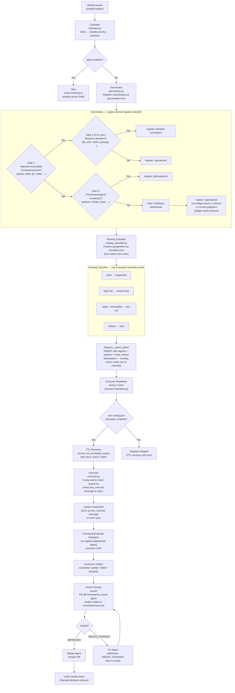

# WOS Pipeline Architecture

**Date:** 2026-04-22
**Status:** Canonical
**Scope:** Full cultivator-to-executor pipeline, including germinator register classification, routing classifier posture assignment, and executor dispatch.

---

## Pipeline Flowchart

---

## Component Legend

| Component | File | Role |
|-----------|------|------|
| **Cultivator** | `src/orchestration/cultivator.py` | Fetches all open GitHub issues, applies skip conditions (meta-tracking labels, existing active UoWs), assigns priority (high/medium/low from labels), and promotes to WOS registry. |
| **Germinator** | `src/orchestration/germinator.py` | Classifies the attentional *register* of each UoW at germination time using a 4-gate ordered algorithm. Register is immutable after germination. |
| **Routing Classifier** | `src/orchestration/routing_classifier.py` | Loads `~/lobster-user-config/orchestration/classifier.yaml` and applies first-match-wins rules to assign a *posture* (solo, sequential, review-loop, fan-out) and a `route_reason`. Falls back to `solo` if classifier YAML is absent. |
| **Registry** | `src/orchestration/registry.py` | SQLite-backed UoW store. `_upsert_typed` inserts new UoWs with `register`, `posture`, and `route_reason` fields; idempotent on active UoWs. |
| **Executor Heartbeat** | `scheduled-tasks/executor-heartbeat.py` | Runs every 3 minutes via cron. Checks `wos-config.json` execution gate, runs TTL recovery, then dispatches ready UoWs via the Executor. |
| **Executor** | `src/orchestration/executor.py` | Performs the 6-step atomic claim sequence (optimistic lock on `ready-for-executor` → `active`). Writes a `wos_execute` inbox message; the Lobster dispatcher spawns the subagent. |
| **Functional-Engineer Subagent** | Dispatched by Lobster | Executes the UoW, writes `result.json`. Register-specific agent routing is applied at dispatch time. |
| **Oracle** | `oracle/` | Reviews PR diffs and writes APPROVED / NEEDS_CHANGES verdicts to `oracle/decisions.md`. PR Merge Gate requires an APPROVED verdict before merge. |
| **Steward** | `src/orchestration/steward.py` | Evaluates completed UoWs, diagnoses failures, and is the only component authorized to mark a UoW `done`. |

---

## Register Types

| Register | Meaning |
|----------|---------|
| `operational` | Deterministic, machine-verifiable success criterion |
| `iterative-convergent` | Requires repeated execution until a gate command passes |
| `philosophical` | Requires Dan's attentional presence; originates from philosophy/frontier sessions |
| `human-judgment` | Success criteria contain hedge words; cannot be evaluated without reading output |

## Posture Types

| Posture | Meaning |
|---------|---------|
| `solo` | Single subagent executes end-to-end |
| `sequential` | Multiple agents in a defined sequence (design-first pattern) |
| `review-loop` | Execution followed by oracle review loop |
| `fan-out` | Work decomposed into parallel subagent tasks |
