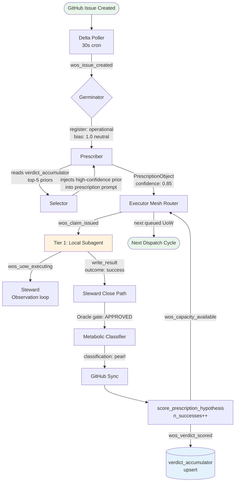
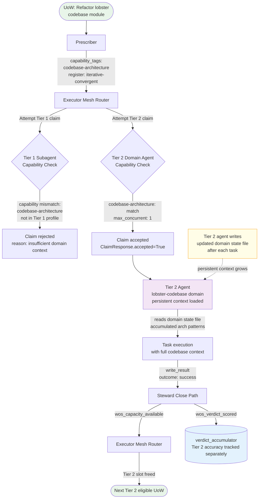
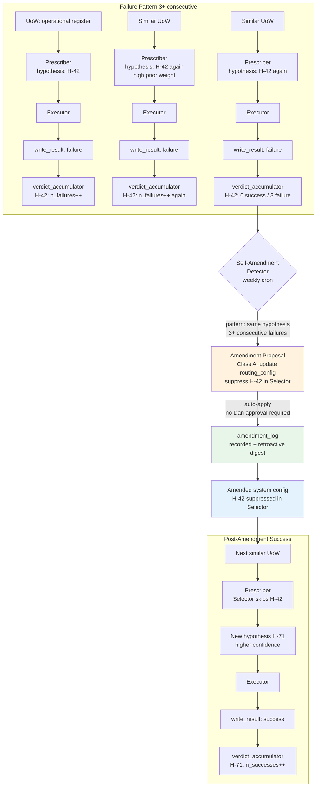
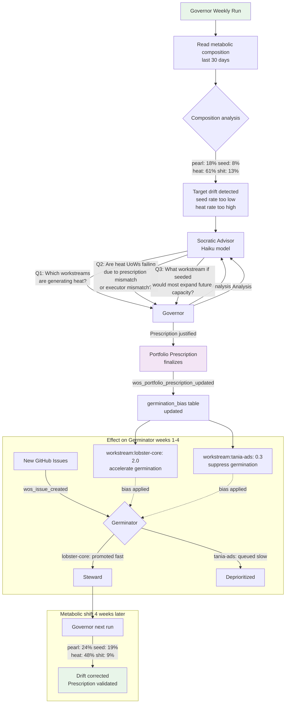
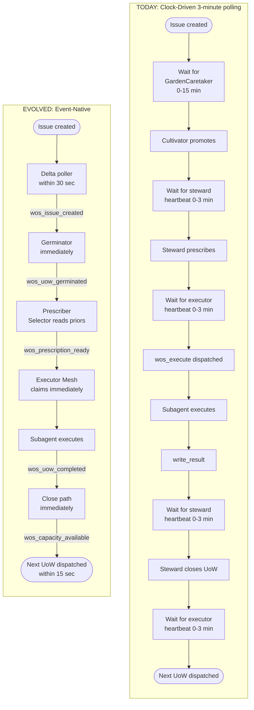

# WOS Evolution Spec — Design and Implementation Sequencing

*Produced 2026-05-29. Covers five structural leaps: Adaptive Steward, Event-Native Nervous System, Executor Mesh, Closed-Loop Self-Amendment, Orientation Layer. Grounded in current WOS codebase (src/orchestration/) and the architectural documents in docs/.*

---

## §1 End State Definition

The end state is a **self-orienting, self-amending, distributed task execution system** in which Dan's cognitive role is reviewer and orientation-setter rather than prescriber and debugger. The system maintains a learning ledger of its own diagnostic accuracy across registers, responds to work events within seconds rather than polling on a 3-minute clock, routes tasks across a typed mesh of execution contexts with different capability profiles, proposes its own behavioral amendments in bounded authority classes, and maintains an ongoing portfolio prescription that aligns its workload with an explicit telos rather than processing whatever the backlog contains.

This is what "autopoietic task execution" means concretely: the system's metabolism — cultivation of issues, germination into UoWs, prescription by the steward, execution by the executor mesh, closure, and metabolic output classification — operates as a self-renewing loop that improves without requiring Dan to author each improvement. Dan's role at full build-out is: set orientation (the Governor layer), approve or reject the system's own amendment proposals (Class B Self-Amendment), and handle the residual human-judgment register UoWs that the system correctly surfaces.

### Observable Signals of the End State

- `verdict_accumulator` table contains at minimum 50 scored prescription hypothesis outcomes per register, with Prescriber accuracy trending upward.
- Mean time from issue-open to germination: **under 60 seconds** (event-driven path active).
- Mean time from UoW completion to next-UoW dispatch: **under 15 seconds** (capacity event fires immediately).
- At least two executor tiers active: Local Claude subagents + one persistent specialized-context agent.
- Self-amendment log non-empty: at least one Class A amendment applied automatically with Dan's retroactive review.
- Portfolio prescription visible as a readable, auditable document.
- Register classification accuracy above 90% (mismatch rate below 10% on 30-day rolling window).

---

## §2 Architecture Diagrams

### Current Architecture

```
CLOCK-DRIVEN POLLING LOOP (current)

  GitHub Issues
       │
       ▼ (every 15 min — GardenCaretaker / daily — github-issue-cultivator)
  ┌─────────────────┐
  │   Cultivator    │  promotes GitHub issues → uow_registry (proposed)
  └────────┬────────┘
           │ auto-advance
           ▼
  ┌─────────────────┐
  │   Germinator    │  classify_register() — 4-gate ordered algorithm
  │                 │  register: operational | iterative-convergent |
  │                 │            philosophical | human-judgment
  └────────┬────────┘
           │ → ready-for-steward
           ▼
  ┌─────────────────────────────────────────┐
  │       STEWARD HEARTBEAT (every 3 min)   │
  │  Phase 0: Stale agent cleanup           │
  │  Phase 1: Startup sweep (orphan)        │
  │  Phase 2: Observation loop + stall      │
  │  Phase 3: LLM prescription (Sonnet/Opus)│
  │  Phase 4: Post-completion GitHub sync   │
  └────────┬────────────────────────────────┘
           ▼
  ┌──────────────────────────────────────────┐
  │       EXECUTOR HEARTBEAT (every 3 min)   │
  │  execution_enabled + scaling_governor    │
  │  → wos_execute inbox message             │
  │  → Lobster dispatcher spawns subagent    │
  └────────┬─────────────────────────────────┘
           ▼
  Claude Subagent → Oracle Gate → write_result()
  → Metabolic Classification (pearl/seed/heat/shit)
  → Steward closes or re-prescribes

REGISTRY: SQLite (wos.db) — uow_registry, audit_log, dispatch_skip_log
METRICS:  SQLite (wos-metrics.db) — prescription_events, closure_events
```

### Target Architecture (All Five Layers)

```
EVENT-NATIVE SELF-ORIENTING MESH (target)

  GitHub Webhooks / 30s delta poller
       │ wos_issue_created (typed inbox event)
       ▼
  ┌───────────────────────────────────────────┐
  │         GOVERNOR (Orientation Layer)      │
  │  Reads: workstreams, health, priorities   │
  │  Writes: portfolio_prescription           │
  │          germination_bias                 │
  │  Paired: Socratic advisor (no directives) │
  └─────────────┬─────────────────────────────┘
                │ germination_bias
                ▼
  ┌──────────────────────────────────────────────────┐
  │       ADAPTIVE GERMINATOR + ADAPTIVE STEWARD     │
  │  Prescriber → PrescriptionObject (typed)         │
  │  Selector → reads verdict_accumulator top-5      │
  │  Verdict Accumulator → (register, hypothesis)    │
  │             → (n_successes, n_failures, n_partial)│
  └─────────────┬────────────────────────────────────┘
                │ wos_uow_completed (typed event)
                ▼
  ┌──────────────────────────────────────────────────┐
  │              EXECUTOR MESH                        │
  │  Tier 1: Local Claude subagents (ephemeral)      │
  │  Tier 2: Persistent specialized agents           │
  │  Tier 3: External executor contract protocol     │
  │  wos_capacity_available event on slot free       │
  └─────────────┬────────────────────────────────────┘
                ▼
  ┌──────────────────────────────────────────────────┐
  │           SELF-AMENDMENT COMPONENT                │
  │  Class A: IFTTT rule changes (auto-apply)        │
  │  Class B: Dan approval required                  │
  │  GUARD: Class A cannot modify amendment logic    │
  └──────────────────────────────────────────────────┘

NEW TABLES: verdict_accumulator, prescription_hypothesis_log,
            amendment_log, executor_registry, event_log,
            portfolio_prescription, germination_bias
EVENT BUS: typed inbox messages (file-based, existing protocol extended)
```

---

## §3 Spine Layer Design

### I. Adaptive Steward (Priority 1)

**New typed output: PrescriptionObject**

```python
@dataclass(frozen=True)
class PrescriptionObject:
    uow_id: str
    register: UoWRegister
    diagnosis_hypothesis: str        # max 140 chars — machine-comparable
    proposed_steps: list[str]
    confidence: float                # 0.0–1.0
    counterfactual_question: str     # "what would falsify this?"
    generated_at: str
    selector_priors: list[str]       # top-5 prior hypothesis IDs
```

**New schema tables:**

```sql
CREATE TABLE IF NOT EXISTS verdict_accumulator (
    id                   INTEGER PRIMARY KEY AUTOINCREMENT,
    register             TEXT    NOT NULL,
    diagnosis_hypothesis TEXT    NOT NULL,
    n_successes          INTEGER NOT NULL DEFAULT 0,
    n_failures           INTEGER NOT NULL DEFAULT 0,
    n_partial            INTEGER NOT NULL DEFAULT 0,
    last_updated         TEXT    NOT NULL,
    UNIQUE(register, diagnosis_hypothesis)
);

CREATE TABLE IF NOT EXISTS prescription_hypothesis_log (
    id           INTEGER PRIMARY KEY AUTOINCREMENT,
    uow_id       TEXT    NOT NULL,
    hypothesis   TEXT    NOT NULL,
    register     TEXT    NOT NULL,
    generated_at TEXT    NOT NULL,
    outcome      TEXT    NULL,
    scored_at    TEXT    NULL
);
```

**Selector:** Pure SQL query on `verdict_accumulator` ordered by success rate. Injects top-5 priors into prescription prompt. No LLM call required.

**Verdict hook:** `score_prescription_hypothesis(uow_id, outcome)` called in `_close_uow`. Idempotent (checks `scored_at IS NULL`). Non-fatal on DB error.

**Test harness (no LLM required):** Unit tests for accumulator upsert, Selector retrieval query, PrescriptionObject serialization. Integration test: close UoW → assert n_successes incremented.

**Key files:** `src/orchestration/steward.py`, `src/orchestration/schema.sql`, `src/orchestration/registry.py`, `src/orchestration/prescription_metrics.py`, `scripts/upgrade.sh`.

---

### II. Event-Native Nervous System (Priority 3, parallel with Stage 1)

**Three new typed inbox message types:**

```
wos_issue_created:    issue_number, issue_url, title, labels, triggered_at
wos_uow_completed:    uow_id, outcome, register, output_ref, triggered_at
wos_capacity_available: freed_uow_id, freed_at, current_active_count, max_parallel
```

**New module:** `src/orchestration/wos_events.py` — three pure emit functions writing JSON to `~/messages/inbox/`.

**Issue delta poller:** `scheduled-tasks/wos-issue-delta-poller.py` (Type B cron, every 30 seconds). Reads GitHub since-cursor, emits `wos_issue_created` on delta.

**Heartbeat demotion:** Behind `event_native_active: true` feature flag in `wos-config.json`. Steward heartbeat: `*/3` → `*/5` (orphan recovery only). Executor heartbeat: unchanged. GardenCaretaker: retained as reconciliation backstop.

**New schema:** `event_log` table.

**Key files:** `src/orchestration/wos_events.py` (new), `scheduled-tasks/wos-issue-delta-poller.py` (new), `src/orchestration/dispatcher_handlers.py`, `src/orchestration/result_writer.py`, `src/orchestration/executor.py`.

---

### III. Executor Mesh (Priority 4, after learning layer)

**Claim Protocol:**

```python
@dataclass(frozen=True)
class ExecutorCapabilityProfile:
    executor_id: str
    supported_registers: list[str]
    supported_postures: list[str]
    max_concurrent: int
    capability_tags: list[str]
    claim_endpoint: str | None    # None = local subagent

@dataclass(frozen=True)
class ClaimResponse:
    accepted: bool
    executor_id: str
    reason: str | None
```

**Tier 2 agent design:** Long-running Claude Code session with domain-scoped bootup file. Writes state file after each task; reads on activation. Domain: `tier2-lobster-codebase` (knows lobster codebase, accumulates architectural patterns).

**Tier 3:** Publish-subscribe on existing inbox protocol. UoW appears in `wos-proposals/` directory. First valid claim within 10-second window wins (optimistic lock).

**New schema:** `executor_registry` table.

**New module:** `src/orchestration/executor_mesh.py`.

---

### IV. Closed-Loop Self-Amendment (Priority 2)

**Amendment classes:**
- **Class A** (auto-apply): IFTTT rule changes, routing config updates. Bounded to `CLASS_A_ALLOWED_COMPONENTS = frozenset({"ifttt_rule", "routing_config"})`. Structural guard: PermissionError if out-of-scope component attempted.
- **Class B** (Dan approval): All other changes. Surfaced via Telegram with Yes/No buttons. Proposal includes rationale, evidence, specific before/after change.

**Detection rules:**
1. IFTTT rule overridden 4+ times in 30 days → propose deletion (Class A)
2. Label combination routes to register X but 70%+ steward-escalation rate → propose germinator pre-filter (Class B)
3. Same `diagnosis_hypothesis` in 3+ consecutive failures for same register → prescription recycling flag (Class B)

**New schema:** `amendment_log` table.

**New modules:** `src/orchestration/self_amendment.py`, `scheduled-tasks/self-amendment-generator.py` (weekly cron).

---

### V. Orientation Layer (Priority 5, last)

**Governor output:** `PortfolioPrescription` — workstream emphasis weights, register targets, suppressed workstreams, Socratic exchange record.

**Socratic advisor:** Question-only session (Haiku). Structurally prevented from issuing directives (system prompt constraint + optional output validation). Must pose minimum 3 questions before Governor finalizes prescription.

**Germination bias:** `GerminationBias` per workstream (0.1 = suppressed, 1.0 = neutral, 2.0 = accelerated). Applied by Germinator at issue promotion time.

**New schema:** `portfolio_prescription`, `germination_bias` tables.

**New modules:** `src/orchestration/governor.py`, `src/orchestration/socratic_advisor.py`, `scheduled-tasks/governor-weekly.py` (weekly LLM task).

---

## §4 Load-Bearing Abstractions

| Term | Definition |
|------|-----------|
| **Prescription** | Typed PrescriptionObject output by Prescriber (not prose string) |
| **Verdict** | Scored outcome for a specific hypothesis after UoW closes |
| **Verdict Accumulator** | Persistent store: (register, hypothesis) → (n_successes, n_failures, n_partial) |
| **Selector** | Component that reads Verdict Accumulator and biases Prescriber toward high-accuracy hypothesis types |
| **Portfolio Prescription** | Governor output: workstream emphasis weights + register targets (portfolio-level, not UoW-level) |
| **Germination Bias** | Per-workstream multiplier on issue promotion speed (derived from portfolio prescription) |
| **Lever** | Category of improvement action: scaffold lever (IFTTT/config), learning lever (selector biasing) |
| **Class A / Class B Amendment** | A = auto-apply within bounded scope; B = requires Dan's explicit approval |
| **Executor Mesh** | Multi-tier execution population: Tier 1 (ephemeral), Tier 2 (persistent domain), Tier 3 (external) |
| **Claim Protocol** | Typed interface for executor capability matching and UoW claiming |
| **Capacity Event** | `wos_capacity_available` inbox message fired when executor slot frees |
| **Coupled Goodhart** | Failure mode where Prescriber and Executor optimize against same verdict context (Nash equilibrium, not true improvement) |

---

## §5 Implementation Sequencing

| Stage | Evolution | Prerequisite | Estimate | Gate Condition |
|-------|-----------|-------------|----------|----------------|
| 1 | Adaptive Steward | None | 3–5 days | verdict_accumulator has 20+ scored outcomes |
| 2 | Event-Native (parallel with 1) | None | 2–3 days | 10 consecutive event-driven completions without heartbeat gap |
| 3 | Self-Amendment Class A | Stage 1 complete | 3–4 days | At least 1 Class A amendment applied and Dan-reviewed |
| 4 | Executor Mesh Tiers 1+2 | Stages 1–3 stable | 4–6 days | Tier 2 agent handles 20+ UoWs; capability matching proven |
| 5 | Orientation Layer | All prior + 90d verdict data | 5–7 days | First portfolio prescription reviewed and approved by Dan |

---

## §6 Design Decision Forks

Three blocking forks require Dan's input. Two non-blocking forks are decided by the implementation team.

### Fork 1 — Verdict Matching Strategy (BLOCKING, needed before Stage 1)

- **Option A:** Exact string match (normalized). Simple, instant, testable. Risk: synonym fragmentation.
- **Option B:** Semantic clustering via embedding similarity. Better learning signal. Requires vector infrastructure.
- **Option C:** LLM-assisted normalization at scoring time. Most expensive.

**Dan's question:** Start with exact match (A) and migrate to embedding clustering (B) when fragmentation is observed, or build B now so the ledger starts clean?

### Fork 2 — Tier 2 Agent State Persistence (BLOCKING, needed before Stage 4)

- **Option A:** Isolated state file (JSON per domain, no shared infrastructure). Simple, bounded.
- **Option B:** Shared memory DB with domain partition field. Cross-pollination possible.
- **Option C:** Dedicated memory partition (migration required). Cleanest isolation.

**Dan's question:** Should Tier 2 domain knowledge be accessible to the dispatcher and other agents (Option B) or strictly isolated to the Tier 2 agent (Option A)?

### Fork 3 — Governor Authority Model (BLOCKING, needed before Stage 5)

- **Option A:** Promote-only. Governor can accelerate germination but cannot suppress.
- **Option B:** Full bias authority (promote and suppress within defined bounds).
- **Option C:** Advisory only. Governor produces a readable prescription; Dan manually adjusts.

**Dan's question:** This is the most philosophically load-bearing decision in the spec. How much autonomous authority should the Governor have over work prioritization? Recommend starting with Option A and expanding authority as trust develops — but this requires your explicit input.

### Fork 4 — Event Bus Transport (Non-blocking)

**Decision:** File-based inbox protocol (Option A). Durability over sub-second latency.

### Fork 5 — Socratic Advisor Constraint Enforcement (Non-blocking)

**Decision:** System prompt constraint only (Option A) with output validation (Option B) added if constraint breaks in practice.

---

## §7 Claude API and Model Usage Design

| Component | Model Tier | Prompt Caching |
|-----------|-----------|----------------|
| Prescriber (first attempt) | Sonnet | Yes — static system prompt cached |
| Prescriber (escalation, cycles > 1) | Opus | Yes |
| Selector retrieval | None (SQL) | N/A |
| Verdict normalization (if Option C) | Haiku | Yes |
| Governor | Sonnet | Yes — static context cached |
| Socratic advisor | Haiku | Yes — no-directive system prompt cached |
| Self-amendment generator | Sonnet | Yes — detection rules cached |
| Executor Tier 1 | Sonnet | Unchanged |
| Executor Tier 2 | Sonnet / Opus (escalation) | Yes — domain bootup file cached |

**Caching pattern (all new components):**

```python
messages = [{
    "role": "user",
    "content": [
        {
            "type": "text",
            "text": STATIC_SYSTEM_PROMPT,
            "cache_control": {"type": "ephemeral"}
        },
        {
            "type": "text",
            "text": dynamic_uow_context  # not cached
        }
    ]
}]
```

**Scaffold testing isolation:** Every new component has a pure-Python non-LLM path. LLM calls are isolated in named functions (`_call_llm_prescriber`, `_generate_portfolio_prescription`, etc.) that are mockable in unit tests. All unit tests pass without an API key. Integration tests requiring an API key are clearly marked.

**Model config in `wos-config.json`:**

```json
{
    "prescription_model": "opus",
    "governor_model": "sonnet",
    "socratic_advisor_model": "haiku",
    "amendment_generator_model": "sonnet"
}
```

---

## What Is Needed From Dan Before Implementation

**Stages 1, 2, and 3 can begin immediately** — no blocking forks apply.

**Blocking inputs required:**
1. **Fork 1** (verdict matching): exact match or embedding clustering from the start? (needed before Stage 1 commit)
2. **Fork 2** (Tier 2 state): isolated state file or shared memory partition? (needed before Stage 4)
3. **Fork 3** (Governor authority): promote-only, full bias, or advisory? (needed before Stage 5 — this is the most important)

---

*Design spec complete. No implementation changes to production WOS. Bisque URL: http://5.78.201.64:9101/files/wos-evolution-spec.html*

---

## §8 Token Ergonomics and Metabolic Observability

*Full section: `~/lobster-workspace/workstreams/wos-evolution-spec/token-ergonomics.md`. Key findings condensed here.*

**Per-component call accounting:** The evolved system adds six LLM-consuming components. Three add zero net calls (Event-Native event handlers, verdict scoring, germination bias writes). Adaptive Steward adds 0 calls under Fork 1 Option A (exact match) or Haiku-tier calls under Option C. Executor Mesh Tier 2 is call-neutral per UoW (same as Tier 1, higher cache rate). Closed-Loop Self-Amendment adds 0–1 Sonnet call per weekly run. Orientation Layer Governor adds 1 Sonnet + 3–5 Haiku calls per weekly run. The call budget of the evolved system scales primarily with UoW throughput, not with component count.

**Metabolic taxonomy extensions:** Pearl from Adaptive Steward = hypothesis with > 0.7 success rate after 5+ observations. Heat from Adaptive Steward = hypothesis that churns (equal success/failure, never converges). Heat from Event-Native = events that trigger germination but produce no executed UoW (queue-filling without execution). Heat from Governor = a PortfolioPrescription that changes germination biases but not the actual metabolic output distribution. Shit from Self-Amendment = a Class A amendment that Dan manually reverts.

**Five new heat-generating attractors (not present in current system):**

1. **Churn Basin** (Adaptive Steward): Semantic variation in hypothesis strings fills the verdict_accumulator with low-observation-count rows that never converge. Detection: > 100 distinct hypotheses per register with mean observations < 5. Remediation: Fork 1 resolution (embedding clustering).

2. **Excitable Germinator** (Event-Native): Issue bursts drive germination faster than execution capacity. Pending queue exceeds 5x max_parallel, generating observation-loop calls against a stale queue. Detection: queue-depth ratio > 5x for > 30 minutes. Remediation: germination rate cap at `max_parallel * 3` per 30-second window.

3. **Philosophical Flywheel** (Orientation Layer Governor): Well-formed portfolio prescriptions that change germination_bias vectors but produce no measurable shift in metabolic output distribution. Detection: KL divergence between prescribed and actual germination distribution > 0.3 across 2 consecutive runs. Remediation: increase Socratic advisor minimum questions; require at least one question challenging the prior prescription's outcomes.

4. **Rulemaker's Loop** (Closed-Loop Self-Amendment): Amendment generator proposes multiple Class A changes per week, producing an unstable IFTTT rule set that changes routing behavior, which generates new verdict patterns, which generates new proposals. Detection: > 3 Class A amendments auto-applied in one weekly run. Remediation: hard cap of 2 Class A amendments per weekly run; excess queued for next cycle.

5. **Knowledgeable Stranger** (Executor Mesh Tier 2): Persistent domain agent accumulates stale context. Outputs are domain-confident but based on outdated architectural state. Detection: state_file_age_days > 45 on failure or partial outcome. Remediation: mandatory context refresh step for any Tier 2 activation with state file age > 14 days.

**Observability dashboard (6 metrics):** Call volume week-over-week change | Outcome yield (pearl+seed vs. heat+shit ratio, heat target < 30%, shit target < 5%) | Verdict accumulator health (hypotheses-per-register vs. mean-observations-per-hypothesis) | Germination queue depth (queue / max_parallel ratio) | Governor effectiveness (germination_bias L1 change + prescribed-vs-actual KL divergence) | Amendment rate (Class A applied per week + Class B unanswered count).

**Spine-first invariant:** Every LLM-consuming component has a fully testable non-LLM path. The LLM contribution is the gap between mock-LLM scaffold output and live output. If that gap cannot be measured, the component is not metabolically observable. All five evolved components satisfy this invariant as specified.

---

## §9 Failure Mode Taxonomy and Self-Healing Design

*Full section: `~/lobster-workspace/workstreams/wos-evolution-spec/failure-modes.md`. Key taxonomy and escalation chain condensed here.*

**Failure class definitions:** Class A = system-diagnosable, automatable recovery, no human needed. Class B = system-detectable, requires human decision before recovery. Class C = requires human diagnosis, system cannot determine root cause.

**Failure mode taxonomy by evolution direction (selected high-consequence modes):**

| Evolution Direction | Failure Mode | Class | Recovery Signal |
|---|---|---|---|
| Adaptive Steward | Accumulator stale — scoring hook not called on UoW close | A | Daily integrity check; backfill job |
| Adaptive Steward | Coupled Goodhart — Prescriber+Executor optimize same signal | B | Outcome yield metric degrades while verdict scores rise |
| Adaptive Steward | Register drift — UoW reclassified mid-execution | B | Mismatch between prescription register and closure register |
| Event-Native | Delta poller crash — since-cursor not advanced | A | Heartbeat file monitor; restart + dedup via event_log |
| Event-Native | Heartbeat backstop disabled while event pipeline fails silently | B | No steward activity for >6 min with event_native_active=true |
| Event-Native | Inbox saturation — event burst delays user messages | B | Queue depth threshold alert |
| Executor Mesh | Claim race — duplicate execution | A | Atomic DB UPDATE; losing executor aborts cleanly |
| Executor Mesh | Claim timeout — executor claimed but did not execute | A | Orphan sweep with claim_ttl; escalate after 3 timeouts |
| Executor Mesh | Tier 2 context drift — domain agent holds stale architectural context | B | State file age check at Tier 2 activation |
| Self-Amendment | Scope escape — amendment targets non-allowed component | A | PermissionError guard; immediate Class B escalation |
| Self-Amendment | Amendment loop — runaway cycle of proposals and applications | A | >3 amendments in 60s → cooldown; second loop → Class B |
| Self-Amendment | Recovery window intersection — two mutations to same config scope | A | in_progress flag check before amendment application |
| Orientation Layer | Governor prescription staleness — weekly run failed | B | generated_at age check; >14 days → neutral bias reset + alert |
| Orientation Layer | Telos drift — portfolio prescription drifts from Dan's actual priorities | B | No automated detection; requires periodic human review |
| Orientation Layer | Socratic constraint break — advisor issues directive | B | Output validator; question count enforcement |

**Substrate concern — 33+ undiagnosed dispatcher restarts:** An unstable substrate amplifies every layer. The highest-consequence intersection is Closed-Loop Self-Amendment: a restart mid-amendment can leave config partially modified. Design requirements: (1) all Class A recovery actions must be re-entrant and idempotent; (2) recovery state is persisted before action is taken; (3) self-amendment is gated from firing during active recovery windows (`recovery_in_progress` flag in `wos-config.json`); (4) substrate instability is itself a Class B failure mode tracked by restart frequency. **Class A self-amendment is disabled by default. Activation requires an explicit operator decision that the dispatcher substrate is stable — this is a judgment call, not a checkable condition. There is no metric threshold that confers readiness; the ordering constraint (substrate stability before self-amendment) is load-bearing, but the determination of stability belongs to the operator, not to an algorithm.**

**Escalation chain (bounded — every path terminates):**

```
Class A detected → automated recovery → success: log and continue
                                      → timeout/retry exhausted → Class B

Class B surfaced to Dan → Dan approves proposed action → execute + log
                        → Dan rejects or cannot determine → Class C

Class C → system writes diagnosis artifact → waits → human diagnoses and applies fix
       → human confirms resolution → log with human_resolved = True
       [No further automated attempts. No Class D.]
```

**Class B timeout:** Dan non-response at 48h → reminder. At 96h → escalate to Class C, write diagnosis artifact. System does not act autonomously on unacknowledged Class B.

**Class C minimum artifact** (written to `~/lobster-workspace/assessments/wos-failures/class-c-<timestamp>.md`): observable symptoms, what recovery was attempted, complete state snapshot (relevant DB rows, config values, recent audit_log), system's best hypothesis (may be empty), and explicit list of what a human needs to read to diagnose. Self-contained — no additional query tools required.

**Key design invariants:** No silent state mutation. Amendment gate closed during recovery windows. Escalation is bounded. Class C artifacts are self-contained. Substrate instability is surfaced, not worked around. The amendment logic cannot amend itself (Class A cannot modify `CLASS_A_ALLOWED_COMPONENTS`).

---

## §10 Worked Examples — Canonical Scenarios

Four scenarios chosen for register divergence. Each exposes a different face of the architecture. The synthesis section at the end finds what only becomes visible when you look across all four.

---

### Scenario A: Paper/Book Consumption → First-Principles Learning Partner

Dan pastes the text of a dense academic paper on distributed systems consensus. No explicit ask — just the text, arriving as a Telegram message.

**Signal arrival and dispatch path**

The dispatcher classifies this as a human-judgment UoW: open-ended input, no bounded output artifact, requires Dan's voice and cognitive engagement to have value. It is not iterative-convergent (there is no correct answer to converge toward) and not operational (no system artifact is being produced). A UoW is registered with `register=human-judgment`, `domain_hint=academic-ingestion`.

The Governor's active portfolio prescription has `workstream:learning weight=1.4` (Dan recently expressed intent to engage more with first-principles material). `germination_bias` elevates the UoW to immediate steward attention.

**Adaptive Steward: Selector and Prescriptor**

The Selector queries `verdict_accumulator` filtered to `register=human-judgment` and `domain_hint=academic-ingestion`. It finds a prior hypothesis cluster: "Do not summarize. Reconstruct the conceptual spine — relationships, taxonomies, and the one load-bearing claim — then build a query surface for interactive exploration." Success rate: 0.81 across 11 observations. Confidence is meaningfully high for a human-judgment register, which typically shows higher variance.

The Prescriptor generates a PrescriptionObject with `confidence=0.78`. The proposed steps do not produce a summary. They produce:
1. Adaptive chunking by conceptual density (not page count or token count)
2. Taxonomy and relationship reconstruction — what does the paper assume, what does it establish, how do these relate
3. One-sentence spine: the load-bearing claim the entire structure depends on
4. Query-optimized foundation — a structured artifact Dan can interrogate, not read

The PrescriptionObject includes `counterfactual_question`: "What would it mean for this prescription to fail? If Dan asks a follow-up question and the answer requires re-reading the paper rather than consulting the constructed artifact, the prescription failed."

**Executor Mesh tier**

Tier 1 local subagent handles chunking and reconstruction. This is pure cognitive work with no specialized codebase context required. A Tier 2 agent is not invoked.

The executor produces: a taxonomy of the paper's conceptual structure, a relationship map of its key claims, the one-sentence spine, and an explicit annotation of what the paper does not address (the productive gaps). It surfaces this to Dan with a single message: "Spine reconstructed. What do you want to pull on first?"

**Failure surface for this scenario**

The failure mode specific to academic ingestion is hypothesis echo: the executor produces a reorganized summary that uses the paper's own vocabulary, which feels like a reconstruction but is actually paraphrase. Detection signal: Dan's follow-up questions can be answered by quoting the paper rather than by reasoning from the constructed structure. The verdict scoring hook would record this as `outcome=partial` — technically complete but failing the counterfactual test.

**Escalation path**

If the reconstruction produces something Dan finds useless ("this is just a summary with extra steps"), he says so. The UoW is not re-dispatched immediately — this is a human-judgment register where escalation is informational, not prescriptive. The Prescriptor notes the failure, generates a revised hypothesis, and surfaces it to Dan: "The spine reconstruction approach failed here. Next attempt would use X instead — should I try again?" Dan decides.

**Verdict accumulation**

`prescription_hypothesis_log` records the hypothesis. On close (whether Dan engages productively or signals failure), `score_prescription_hypothesis` is called. A successful interactive exchange where Dan's follow-up questions are answered without re-reading increments `n_successes`. A paraphrase outcome increments `n_partial`. Over time, the Selector learns to inject the counterfactual test into the prescription prompt automatically, not as an afterthought.

**Distinguishing insight**

This scenario reveals that the human-judgment register requires a fundamentally different success metric than the other registers. There is no oracle gate here — there is no correct output to approve. Success is Dan's productive engagement. The verdict accumulator must score against a qualitative criterion (did the artifact support first-principles reasoning?) rather than a binary outcome (did the PR merge?). This is the scenario that most clearly demands the Prescriptor include an explicit `counterfactual_question` field — not as documentation, but as the scoring instrument.

---

### Scenario B: Multi-Register Product Feature Reasoning

Dan asks: "Should we add real-time collaboration to the Bisque editor? I want to reason through the full picture before deciding."

**Signal arrival and dispatch path**

The dispatcher immediately sees multi-register texture: "full picture" signals Dan wants technical, product, and strategic reasoning simultaneously. This is not a bounded implementation task (no artifact to produce), not a diagnostic task, and not creative writing. It sits at the intersection of iterative-convergent (there is a decision to converge toward) and human-judgment (the decision is Dan's, not the system's). The UoW is registered as `register=iterative-convergent` with `domain_hint=product-reasoning` and an annotation that flags multi-register requirement.

**Adaptive Steward: Selector and Prescriptor**

The Selector finds prior hypotheses tagged `multi-register-product-reasoning`. The highest-scoring one: "Decompose into three explicit register traces before synthesizing. Technical trace first (implementation surface and constraints), product trace second (UX, edge cases, real user scenarios), strategic trace third (directional alignment, opportunity cost, what this forecloses). Synthesis only after all three traces complete." Success rate: 0.74 across 6 observations.

The Prescriptor generates a PrescriptionObject with `confidence=0.71`. The three register traces are not optional stages to work through sequentially — they are genuinely different reasoning contexts that must each be run to completion before synthesis. The PrescriptionObject names the specific questions for each register:

- Technical: What is the implementation surface? What does real-time collaboration require at the infrastructure level? What breaks if this is added incrementally vs. designed in?
- Product: What does a user actually experience when a feature is "collaborative"? What are the failure modes that only appear with two users? What problems does this solve that users currently work around?
- Strategic: Does this open a capability that accelerates other planned work, or does it fork the architecture? What does this foreclose? Is the timing right for the current user base?

**Executor Mesh tier**

Tier 1 handles the initial register traces — no persistent domain context is needed for reasoning about a product decision. However, if the Bisque codebase has a Tier 2 domain agent with accumulated architectural context, the technical trace is routed there first. The Tier 2 agent can answer "what breaks at the infrastructure level" with specificity that a Tier 1 agent cannot — it has seen the architecture across multiple tasks.

If no Tier 2 agent is active, the Tier 1 executor reads the relevant codebase sections and produces the technical trace from first principles. Lower fidelity, but still valid.

The three traces are surfaced to Dan as a single structured artifact, not as three separate messages. Dan sees: technical constraints (3-4 bullet points), product texture (2-3 scenarios including edge cases), strategic alignment assessment. Then: "Where do you want to go deeper?"

**Failure surface for this scenario**

The failure specific to multi-register reasoning is register collapse: the executor produces a technically-framed answer that borrows product and strategic vocabulary but reasons only from implementation constraints. The product and strategic registers are present as labels but absent as genuine reasoning frames. Detection: Dan's follow-up probes the product register and gets technical reasoning in response. Verdict: `outcome=partial`, hypothesis flagged for review.

**Escalation path**

If Dan signals that a register was missed ("you didn't actually reason about the UX, you just said it's complex"), the UoW is not closed. The executor returns with a corrected trace for that register. This is not a failure escalation — it is an in-flight correction within the human-judgment interaction loop.

**Verdict accumulation**

The verdict accumulates per hypothesis per register. A multi-register scenario generates a richer verdict signal than single-register scenarios: the scoring hook can record which registers were successful and which collapsed. Over time, the Selector learns to weight the register-decomposition hypothesis more heavily for product-reasoning requests.

**Distinguishing insight**

This scenario is the one that reveals the mismatch between the UoW register classification system (designed for single-register routing) and the reality of Dan's most important decisions (which span registers). The scenario exposes that register is a routing attribute, not a description of the work. Multi-register work cannot be correctly classified as any single register — the current four-gate classifier will collapse it to iterative-convergent and lose the human-judgment texture. The architecture needs a `multi_register` flag or an explicit multi-register routing mode. This is the design gap that only becomes visible in this scenario.

---

### Scenario C: GitHub Repo Audit

Dan provides a GitHub repo URL: a small open-source system for managing structured notes with CLI and sync features.

**Signal arrival and dispatch path**

The dispatcher recognizes this as an iterative-convergent UoW: there is a bounded output artifact (an audit report), a concrete starting state (the repo), and a convergent target (a set of findings). The UoW is registered with `register=iterative-convergent`, `domain_hint=repo-audit`, `input_ref=github.com/example/structured-notes`.

No GitHub issue exists — this was a direct message from Dan. The Germinator creates the UoW directly without a cultivation phase.

**Adaptive Steward: Selector and Prescriptor**

The Selector finds prior hypotheses for `register=iterative-convergent, domain_hint=repo-audit`. The highest-scoring cluster: "Audit in the multi-registered language developed for Lobster architecture. Spine-first: what is this system's load-bearing idea? Then: what patterns parallel Lobster's architecture, where would they integrate, what would need to change? Surface things Dan isn't thinking about — not confirmation of what he already suspects." Success rate: 0.86 across 4 observations.

The PrescriptionObject structures the audit into four explicit traces:
1. Spine extraction: the one load-bearing architectural idea the system is organized around
2. Internal pattern extraction: data structures, execution model, state management patterns, any novel approaches
3. Parallel assessment: where does this overlap with Lobster's architecture? Where does it diverge in interesting ways?
4. High-leverage candidates: specific implementation ideas or patterns that could accelerate Lobster's directional trajectory — ranked by leverage, not by complexity

The PrescriptionObject's `counterfactual_question`: "If the output is a list of features Dan could have discovered by reading the README, the prescription failed. The audit must surface structure the README does not make visible."

**Executor Mesh tier**

This is a strong Tier 2 candidate if a `lobster-codebase` domain agent exists. The parallel assessment (trace 3) requires genuine knowledge of Lobster's current architecture — a Tier 1 agent must read the architecture from scratch on each invocation. A Tier 2 agent with accumulated codebase context can assess parallels with the specificity and depth that makes the audit genuinely useful.

If Tier 2 is active: the Tier 2 agent claims the UoW, loads its domain state file (accumulated architectural patterns from prior tasks), reads the target repo, and runs all four traces with architectural grounding. If Tier 2 is not active: Tier 1 reads the lobster codebase first, which costs additional compute but produces a valid result.

The output is a structured audit artifact, not a prose report. Dan sees a section for each trace, with specific file-level references where relevant, and a ranked list of high-leverage candidates with one-sentence rationale each.

**Failure surface for this scenario**

The failure specific to repo audits is surface reading: the executor lists the repo's features, describes what it does, and labels this an audit. The spine is not extracted, the architectural patterns are described in isolation rather than assessed for parallel value, and the high-leverage candidates are the obvious ones Dan already knows from the README. Detection: the `counterfactual_question` test fails — the output could have been produced by reading the README. Verdict: `n_failures` incremented, hypothesis flagged.

A second failure mode is stale Tier 2 context: the domain agent has accumulated Lobster architecture patterns from six weeks ago, before a significant refactor. Its parallel assessment references modules that no longer exist in their prior form. Detection: state file age at Tier 2 activation. If `state_file_age_days > 14`, the Tier 2 agent runs a mandatory context refresh before proceeding.

**Escalation path**

If the audit surfaces a pattern that has significant integration implications — something that would require architectural changes to Lobster rather than additive implementation — the executor flags this as a human-judgment escalation point and surfaces it explicitly before completing the audit artifact. Dan decides whether to pursue it before the audit continues.

**Verdict accumulation**

The audit hypothesis scores particularly well on the `counterfactual_question` criterion. If Dan's response is "I didn't know about the state management pattern in X — that's directly applicable," the verdict is `n_successes`. If Dan says "this is just a feature list," the verdict is `n_failures`. Over time, the Selector learns that the `counterfactual_question` formulation is load-bearing for repo-audit hypotheses — it prevents surface-reading outputs from scoring as success.

**Distinguishing insight**

This scenario is the one that reveals the difference between Tier 1 and Tier 2 value in the most concrete terms. The parallel assessment requires genuine architectural memory — it cannot be done well from a cold start on every invocation. This scenario makes visible why persistent domain agents are not just an efficiency optimization (fewer tokens re-read) but a qualitative capability upgrade: the comparison between two architectures is only as good as the depth of knowledge about each. The Executor Mesh's tier routing decision has first-order effects on output quality, not just latency.

---

### Scenario D: Website Iteration with Visual Pattern Language Development

Dan wants to iterate the dancetlin.com homepage toward a cleaner visual identity. He has a strong artistic sensibility but does not yet have explicit vocabulary for what he's going for.

**Signal arrival and dispatch path**

The dispatcher sees open-ended aesthetic work with high ambiguity. No bounded output artifact can be stated from the message alone. This is human-judgment register: the domain is aesthetic, the success criterion is qualitative approval, and the system cannot close this UoW autonomously. The UoW is registered with `register=human-judgment`, `domain_hint=visual-design-iteration`, `ambiguity=high`.

The Governor's portfolio prescription has `workstream:dan-site weight=0.9` (neutral, no special acceleration). Germination proceeds at baseline.

**Adaptive Steward: Selector and Prescriptor**

The Selector finds prior hypotheses for `register=human-judgment, domain_hint=visual-design`. The hypothesis pool is thin — this register-domain combination has low observation count. The Selector surfaces a low-confidence cluster: "High-ambiguity aesthetic work: do not produce outputs before building vocabulary. Pose specific questions about reference points, then articulate back what you heard before generating options." Confidence: 0.62, n_observations=3.

The PrescriptionObject reflects this uncertainty explicitly: `confidence=0.58`, `counterfactual_question`: "If Dan sees the first options and says 'not quite, but I can't explain why,' the vocabulary phase failed. The test is whether Dan can use the vocabulary we built together to articulate what's wrong."

The prescribed steps:
1. Vocabulary phase: ask Dan about reference points (specific sites, images, objects) — not "what style do you like" but "what does this site make you feel, and what else makes you feel that?" Articulate back what you heard in a compact vocabulary (5-7 terms).
2. Dan confirms or corrects the vocabulary
3. Generate 3 wireframe-level options using the confirmed vocabulary as explicit design criteria
4. For each option, name which vocabulary term it is optimizing for — making the design reasoning transparent
5. Dan selects or hybrid-combines; iteration proceeds from there

**Executor Mesh tier**

Tier 1 handles the vocabulary phase and wireframe generation. No specialized codebase context is required. Wireframes are produced as structured text descriptions (since the executor cannot generate images directly) or as HTML/CSS scaffolds that approximate the visual direction.

If external visual generation tooling is available as a Tier 3 executor (image generation via contract protocol), the wireframe step routes there. The Tier 3 executor accepts the vocabulary terms as structured input and returns visual options. The claim protocol governs the handoff: the UoW's vocabulary artifact is passed as `input_ref`; the Tier 3 executor returns an `output_ref` pointing to generated images.

**Failure surface for this scenario**

The failure specific to visual design iteration is vocabulary shortcut: the executor skips the vocabulary phase and produces options based on its own aesthetic judgment, framed as responsive to what Dan said. Dan sees options he didn't ask for, expressed in design language he didn't generate. He can't explain what's wrong with them because he has no vocabulary to do so — which is exactly what the vocabulary phase was meant to prevent. Detection: Dan's feedback is in the form of "I don't know, it's just not right." Verdict: `n_failures`, vocabulary phase flagged as load-bearing.

A second failure mode: vocabulary overcapture. The executor produces a vocabulary that is too abstract ("this site has energy" / "that site feels grounded") and cannot function as a design criterion. The wireframes cannot be evaluated against it because it is not actionable. Detection: Dan approves the vocabulary but cannot use it to choose between options. Verdict: `n_partial`.

**Escalation path**

This scenario is the most likely to require multiple human checkpoints before the UoW can close. The human-judgment register inherently cannot be closed without Dan's explicit approval at each phase. The escalation path is not a failure path — it is the designed interaction loop. The system surfaces vocabulary, waits, surfaces options, waits, iterates. Autonomy here is defined differently: not "closes without Dan" but "does not require Dan to manage the process."

**Verdict accumulation**

The verdict accumulates per hypothesis phase. The vocabulary-phase hypothesis is scored separately from the wireframe-generation hypothesis. This scenario generates the most granular verdict signal of the four — each phase is a distinct prescription that can succeed or fail independently. Over time, the Selector learns that the vocabulary phase is not optional for aesthetic work, regardless of how quickly Dan seems to want to see options.

**Distinguishing insight**

This scenario reveals the hardest edge of the architecture: what does "prescription" mean when there is no domain truth to verify against, only Dan's response? The verdict accumulator scores outcomes — but in aesthetic work, the outcome is entirely subjective. This is the scenario that most directly challenges the Selector's assumption that prior success rates are predictive of future success. A vocabulary-building approach that worked for one visual project may be entirely wrong for another, because the domain knowledge (Dan's aesthetic sensibility in a particular context) is not transferable the way code patterns or diagnostic hypotheses are. The architecture handles this by maintaining low confidence scores for aesthetic-domain hypotheses and keeping the Prescriptor's autonomy low — not because the system has failed, but because the correct epistemic posture for this domain is humility about prior accuracy.

---

### Synthesis: What Four Scenarios Show Together

Three structural principles become visible only across all four scenarios. No single scenario surfaces any of them.

**1. Register is a routing heuristic, not a description of the work**

Scenario B (product feature reasoning) sits simultaneously in iterative-convergent and human-judgment. Scenario C (repo audit) is iterative-convergent in structure but human-judgment in value criterion. Scenario D (visual design) appears human-judgment throughout but has iterative-convergent sub-phases (vocabulary building has a convergent target). The register system routes UoWs into the right rough territory, but the Prescriptor's work is to discover the actual texture of the UoW within that territory. The four scenarios together show that register classification is the beginning of prescription, not the substance of it. A system that treats register as the full prescription is not yet prescribing.

**2. The verdict accumulator's most valuable signal is what it cannot score**

In Scenario A (paper ingestion), the success criterion is Dan's productive engagement — not a binary outcome. In Scenario D (visual design), the success criterion is Dan's ability to use vocabulary the system helped build — a meta-criterion about the interaction itself. In both cases, the verdict accumulator can record `n_successes` or `n_failures`, but the hypothesis it is scoring captures a qualitative test (`counterfactual_question`), not a checkable condition. The four scenarios together reveal that the accumulator's structure — which looks like a frequency table — is actually a carrier for qualitative hypothesis formulations. The numbers are downstream of the question. A well-formed counterfactual question in the hypothesis text is worth more than a high observation count under a poorly-formed one. The Selector's retrieval logic should weight hypothesis quality, not just success rate.

**3. Autonomy is register-specific, not a single dial**

Scenario A can close without Dan if he engages productively with the constructed artifact. Scenario B cannot close without Dan's decision. Scenario C can close autonomously if the audit artifact meets the counterfactual test. Scenario D cannot close without Dan's approval at every phase. The architecture's handling of autonomy is not a global setting — it is an emergent property of register, domain, and the specific prescription generated for each UoW. Looking across all four: the system is most autonomous in iterative-convergent work with dense verdict coverage, least autonomous in human-judgment aesthetic work where the success criterion is a qualitative response. The Orientation Layer's Governor cannot set a single "autonomy level" — it can only shift the distribution of what work gets taken on, which shifts the distribution of autonomy implicitly. This is the most architecturally significant insight across the four scenarios: autonomy is a consequence of work composition, not a configurable property.

---

## §11 Event-Native Mesh Topology

*Full topology analysis, event consumer model, and clustering analysis: `~/lobster-workspace/workstreams/wos-evolution-spec/topology.md`. The four key routing patterns are reproduced here.*

### Pattern 1: Single-Executor Happy Path

A well-understood UoW with a high-confidence hypothesis and dense verdict accumulator coverage flows through the mesh without escalation.



**Key insight:** The inner loop (claim to execute to close to re-dispatch) closes in under 15 seconds. The Selector's retrieval of matching priors means well-understood problem types benefit from accumulated wisdom without additional LLM cost.

---

### Pattern 2: Multi-Tier Routing (Executor Mesh Escalation)

A UoW requiring specialized domain context routes past Tier 1 to a persistent Tier 2 domain agent.



**Key insight:** The mesh routes by capability profile, not by load alone. Tier 2 agents accumulate domain knowledge across tasks — the persistent context state file grows richer with each execution. Over time, their verdict_accumulator success rates outpace Tier 1 for their domain.

---

### Pattern 3: Self-Amendment Cycle

A recurring failure pattern with the same hypothesis triggers a Class A amendment. Subsequent UoWs succeed under the amended configuration.



**Key insight:** The system closes the improvement loop without Dan. The structural guard (Class A bounded to `{"ifttt_rule", "routing_config"}`) prevents the amendment logic from modifying itself — that recursive case always requires Class B approval.

---

### Pattern 4: Governor Reorientation

The Orientation Layer detects metabolic drift, generates a new portfolio prescription via Socratic dialogue, and shifts germination biases. The UoW mix reorients over subsequent weeks.



**Key insight:** The Governor operates at portfolio granularity, not UoW granularity. It shifts the probability distribution over what gets worked on. The Socratic advisor structure ensures no prescription finalizes before at least three questions have been posed.

---

### Clock-Driven vs. Event-Native: Side-by-Side



**Wall-clock comparison:** Today: 6-27 minutes, coupled to clock not to work. Evolved: 1-3 minutes, driven by events. The event-native mesh exposes the coupling between dispatch latency and learning rate that the clock-driven loop obscures — removing the heartbeat floor makes the Adaptive Steward's verdict accumulation substantively more powerful by tightening the feedback loop between UoW completion and next prescription.
